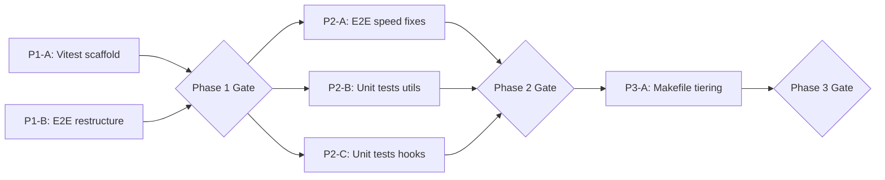

# Dev Plan — Test Optimization

> Dev unit size: 0.5 developer-day

## Architecture Summary

The current `make test` runs a single Puppeteer E2E test (`tests/title-filter.test.mjs`) that takes ~8-10s due to hardcoded `delay()` calls, sequential test execution, and `networkidle0` waits. The target architecture introduces a **tiered testing strategy**:

| Layer | Runner | Scope | Budget |
|-------|--------|-------|--------|
| Unit (Tier 1) | Vitest | Pure logic — utils, config, hooks | < 2s total |
| E2E (Tier 2) | Puppeteer | UI integration — title filter, navigation | < 4s total |

**Key design decisions:**

| Decision | Rationale |
|----------|-----------|
| Vitest for unit tests | Already uses Vite; zero-config; native ESM + TypeScript; instant HMR rerun |
| Keep Puppeteer for E2E | Visual/interaction fidelity for mobile bottom sheet & z-index testing |
| Event-driven waits replace `delay()` | Eliminates ~3.3s of arbitrary sleep; makes tests faster AND deterministic |
| Parallel desktop + mobile pages | Same browser instance; halves E2E wall-clock time |
| Tiered Makefile targets | `make test` = fast unit only; `make test:e2e` = full integration |

## Current State → Target State

```
CURRENT                              TARGET
─────────────────────────────────    ─────────────────────────────────
make test → puppeteer E2E (~10s)     make test → vitest unit (< 2s)
                                     make test:e2e → puppeteer (< 4s)
                                     make test:all → both (< 6s)

tests/title-filter.test.mjs          tests/unit/*.test.ts (vitest)
  - 7× delay() calls (~3.3s waste)   tests/e2e/title-filter.test.mjs
  - sequential desktop → mobile         - waitForSelector() replaces delay()
  - networkidle0 (~1s waste)             - parallel desktop + mobile
                                         - domcontentloaded wait
```

---

## Phase 1: Foundation — Vitest Setup & Test Infrastructure

| Track | Components | Owner | Deliverables | Dev Units | Depends On |
|-------|-----------|-------|--------------|-----------|------------|
| A: Vitest scaffold | `vitest.config.ts`, `package.json`, test helpers | — | Working `npx vitest run` with zero tests passing, path aliases configured | 1 | — |
| B: E2E directory restructure | `tests/` → `tests/e2e/` | — | Move existing E2E test to `tests/e2e/title-filter.test.mjs`, update `package.json` script | 1 | — |

**Gate:** `npx vitest run` exits 0 (no tests yet); `node tests/e2e/title-filter.test.mjs` still works from new location.

---

## Phase 2: Core Implementation

| Track | Components | Owner | Deliverables | Dev Units | Depends On |
|-------|-----------|-------|--------------|-----------|------------|
| A: E2E speed optimization | `tests/e2e/title-filter.test.mjs` | — | Replace all `delay()` with `waitForSelector()`; switch to `domcontentloaded`; parallelize desktop + mobile with `Promise.all` | 1 | Phase 1 Gate |
| B: Unit tests — utils | `tests/unit/urlState.test.ts`, `tests/unit/cuisineRegistry.test.ts` | — | Unit tests for `readSelectionParams`, `writeSelectionParams`, `mergeTaxonomies`, `getGroupStyle`, `getGroupLabel` | 1 | Phase 1 Gate |
| C: Unit tests — hooks (pure logic) | `tests/unit/useFilters.test.ts` | — | Unit tests for filter toggle/toggleAll logic using `@testing-library/react-hooks` or direct invocation | 1 | Phase 1 Gate |

**Gate:** `npx vitest run` passes all unit tests (< 2s); `node tests/e2e/title-filter.test.mjs` completes in < 4s.

---

## Phase 3: Integration — Tiered Execution & CI

| Track | Components | Owner | Deliverables | Dev Units | Depends On |
|-------|-----------|-------|--------------|-----------|------------|
| A: Makefile tiered targets | `Makefile`, `package.json` scripts | — | `make test` = vitest only; `make test:e2e` = puppeteer; `make test:all` = both. Update `scripts` in package.json to match. | 1 | Phase 2 Gate |

**Gate:** `make test` < 2s; `make test:all` < 6s; all tests green.

---

## Summary Table

| Phase | Tracks | Total Dev Units | Gate Criteria |
|-------|--------|-----------------|---------------|
| Phase 1: Foundation | A: Vitest scaffold, B: E2E restructure | 2 | `vitest run` exits 0; E2E still works from new path |
| Phase 2: Core | A: E2E speed, B: Unit utils, C: Unit hooks | 3 | Unit < 2s, E2E < 4s, all pass |
| Phase 3: Integration | A: Makefile tiering | 1 | `make test` < 2s, `make test:all` < 6s |
| **Total** | | **6** | |

## Dev Unit Metrics

| Metric | Value |
|--------|-------|
| Total dev units | 6 |
| Max parallel tracks | 3 (Phase 2) |
| Phases | 3 |
| Critical path length | 4 dev units |

## Dependency Graph



**Critical path:** P1-A → P2-B → P3-A (4 dev units sequential through gates)

## Implementation Notes

### Phase 2-A: E2E Speed Fixes (Key Transforms)

| Before | After |
|--------|-------|
| `await delay(300)` after chip click | `await page.waitForSelector(".seg-dropdown", { visible: true })` |
| `await delay(500)` after selection | `await page.waitForFunction(() => !document.querySelector(".seg-dropdown"))` |
| `await delay(1000)` for mobile lazy load | `await page.waitForSelector(".dynamic-title--compact", { visible: true })` |
| `waitUntil: "networkidle0"` | `waitUntil: "domcontentloaded"` |
| Sequential `await testDesktop(); await testMobile()` | `await Promise.all([testDesktop(browser), testMobile(browser)])` |

### Phase 2-B: Unit Test Targets

| Module | Functions to Test | Strategy |
|--------|-------------------|----------|
| `src/utils/urlState.ts` | `readSelectionParams`, `writeSelectionParams` | Mock `window.location` / `window.history` |
| `src/config/cuisineRegistry.ts` | `mergeTaxonomies`, `getGroupStyle`, `getGroupLabel` | Pure logic — direct assertion |

### Phase 2-C: Hook Test Target

| Hook | Logic to Test | Strategy |
|------|---------------|----------|
| `src/hooks/useFilters.ts` | `toggle`, `toggleAll`, `enableGroup`, `venueFilter` | `renderHook` from `@testing-library/react` |
