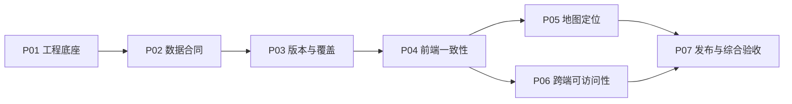

# Foodie Map 专业前端建设

本轮交付是可供其他 Agent 开发的目标、边界、计划与验收合同。业务实现尚未开始。Packet 使用 OpenSpec 的标准 change 表示；具体要求以各 Packet 的 specs 为唯一验收正文，本文件负责总体目标、依赖和跨包判定。

## 1. 目标从哪里来

核心维护变化是：在既有地图产品上，新增一个城市范围，或者为已有城市增加一个新的米其林版次。可信的变化必须沿以下路径贯通：

覆盖范围与官方依据 → 餐厅事实与派生数据 → 可独立读取的版本 → 同一版本的界面状态 → 可操作且位置正确的地图 → 可重复验证和发布。

工程底座使这条路径可复现；发布验证使结果可交接。因此按这些责任划分 Packet，而不是按文件夹、编程语言或 Agent 数量拆包。

| 项目目标 | 总体验收标准 | 主要 Packet |
|---|---|---|
| G1 可持续扩展 | 在已有榜单类型、语言与坐标域内，新增城市或年度只需改数据、catalog、taxonomy/mappings 及必要来源材料；不改选择器、地图或卡片业务代码。用隔离 fixture 演练新增城市与同城两版。 | P02、P03、P04 |
| G2 内容可信 | 榜单身份、采集时间、来源与完整性可追溯；未知保持未知；名单完整度与可定位数量分别表达；旧版不会被新版覆盖或被当前营业状态悄悄改写。 | P02、P03、P05 |
| G3 用户可以可靠完成任务 | 桌面与移动端可完成选版本、搜索、筛选、看详情、地图/热力图切换；键盘可达；加载失败、离线和定位拒绝都有正确状态，绝不把旧数据标成新版本。 | P04、P05、P06、P07 |
| G4 其他 Agent 可以接手 | 从干净 checkout 按文档安装、校验、构建、验证；交接有按要求编号的证据；发布与回滚可演练，验收负责人无需重新猜测实现者的隐含判断。 | P01、P03、P07 |

## 2. 范围与保留的架构判断

- 继续围绕 React、TypeScript、Vite、静态 JSON 和静态部署演进。
- 本轮包含工程规范、数据和版本合同、前端状态、地图正确性、可访问性、性能与发布验证。
- 本轮不包含后端、账号、管理后台、全平台爬虫、用户画像、跨所有榜单的餐厅主数据服务或全面视觉重做。
- 允许为可访问性、信息一致性和错误处理调整现有界面；2026-05 原型迁移的“像素完全不变”不作为这次质量建设的验收目标。
- 实际新增哪一座城市、哪一版官方名单，是后续数据任务。工程扩展演练使用明确标识的测试数据，不把模拟 2027 名单发布成真实米其林数据。
- 不为每份数据再建独立工作流或服务。已有 catalog、数据文件、taxonomy、runbook 和 OpenSpec artifacts 能承担的含义由它们承担。

## 3. 审阅基线与证据边界

基线提交：`fb7c22e`。2026-09-13 仓库有 6 个地区配置、11 份餐厅文件、402 条记录；这些数量是审阅基线，不是未来写死的测试上限。

| 已知事实 | 代码或材料 | 负责处理 |
|---|---|---|
| 上海映射格式使 boarding 报错；香港转换会删除 venue_type、改名港币字段 | [board.py](../../skills/cuisine-boarding/board.py)、[上海 mappings](../../public/data/taxonomy/shanghai-mappings.json) | P02 |
| 4 条坐标为 0,0；18 条 geocode_success=false；6 条派生分组与映射不一致 | [餐厅数据](../../public/data/)、[地图过滤](../../src/components/MapShell.tsx) | P02、P05 |
| 年份选择已存在，路径未分版；新晋标签固定为 2026 | [城市登记](../../src/config/cities.ts)、[桌面卡片](../../src/components/RestaurantMarker.ts)、[移动卡片](../../src/components/MobilePopupCard.tsx) | P03、P04 |
| 覆盖表写 368 条，部分已有地区仍标 Needed | [接入指南](../../readme/data-onboarding-guide.md)、[覆盖表生成器](../../scripts/render-coverage-table.py) | P03 |
| 全局 taxonomy 合并按第一份定义决定标签；加载失败保留旧数据 | [分类登记](../../src/config/cuisineRegistry.ts)、[加载 hook](../../src/hooks/useGuideData.ts) | P04 |
| 地图运行依赖 HTML 中的 CDN 脚本；部署只构建 | [HTML](../../index.html)、[部署工作流](../../.github/workflows/deploy.yml) | P01、P07 |
| 坐标转换的地域判断与注释不一致 | [坐标转换](../../src/utils/gcj02.ts) | P05 |

上述数据结构、映射与脚本问题已通过本地读取或只读执行复现。没有逐店联网确认官方名单和坐标；重复坐标不自动等于错误。当前依赖尚未安装，之前 `npm test` 因找不到 Vitest 未能启动；没有可沿用的“测试已通过”结论，也没有当前性能基线。

## 4. Packet 划分与大验收标准

| Packet / change | 大验收标准 | 验收前置 | 验收细则 |
|---|---|---|---|
| P01 [工程底座](../../openspec/changes/p01-frontend-engineering/proposal.md) | 干净环境能按固定入口安装、检查、测试和构建；地图代码依赖受锁文件管理；外部服务失效不阻止应用壳启动。 | 无 | [frontend-engineering](../../openspec/changes/p01-frontend-engineering/specs/frontend-engineering/spec.md) |
| P02 [数据契约与质量](../../openspec/changes/p02-guide-data-contract/proposal.md) | 一份可执行契约约束数据；转换不损失无关事实；错误可定位；已有记录迁移有完整对账，未知值不会被伪造为成功。 | P01 的运行/检查入口 | [guide-data-contract](../../openspec/changes/p02-guide-data-contract/specs/guide-data-contract/spec.md) |
| P03 [版本、覆盖与接入运维](../../openspec/changes/p03-versioned-guide-coverage/proposal.md) | 城市/榜单/版次可以独立发布与读取；覆盖登记、前端和文档同源；另一 Agent 可按 runbook 完成新增城市与年度更新演练。 | P02 的记录与校验契约；BC-01 对迁移部分的判定 | [guide-coverage](../../openspec/changes/p03-versioned-guide-coverage/specs/guide-coverage/spec.md) |
| P04 [前端状态与展示一致性](../../openspec/changes/p04-consistent-guide-experience/proposal.md) | URL、选择器、数据、卡片、筛选和统计始终指向同一数据集；竞争、失败、未知字段与每城分类都有明确行为。 | P02、P03 | [guide-experience](../../openspec/changes/p04-consistent-guide-experience/specs/guide-experience/spec.md) |
| P05 [地图与定位正确性](../../openspec/changes/p05-map-location-correctness/proposal.md) | 坐标解释有证据；点、热力图和定位采用一致空间规则；无效点不绘制；切换、权限和清理不存在持续错误或资源残留。 | P01、P02、P04 | [map-location](../../openspec/changes/p05-map-location-correctness/specs/map-location/spec.md) |
| P06 [跨端与可访问性](../../openspec/changes/p06-accessible-responsive-interface/proposal.md) | 核心流程在指定视口、键盘和触摸下可完成；焦点、语义、错误提示、视觉状态与移动布局有可检查证据。 | P04 的状态与展示合同 | [accessible-interface](../../openspec/changes/p06-accessible-responsive-interface/specs/accessible-interface/spec.md) |
| P07 [发布与持续质量](../../openspec/changes/p07-release-quality-gates/proposal.md) | CI 拦截坏数据和回归；浏览器、性能、缓存升级、离线和回滚有可重复验证；最终综合演练通过。 | P01–P06 | [release-quality](../../openspec/changes/p07-release-quality-gates/specs/release-quality/spec.md) |

每个 spec 的 `Pxx-Rn` 是验收组，`Pxx-Rn-Sn` 是具体场景。任务只引用这些要求，避免在计划、测试清单和开发说明中分别维护不同版本的标准。

## 5. 开发顺序、依赖与文件责任

建议先收敛 P01/P02 的运行入口和数据合同，再推进 P03/P04。P05 与 P06 在 P04 的接口稳定后可以分别开发，P07 承担最终发布集成与综合验证。

依赖表示合入与验收所需的上游结果，不限制开发者提前做独立调查、原型或基于已约定接口的实现。尚未被验证的上游假设必须在交接中标明。



| 稳定责任 / 权威位置 | 主要 Packet | 交接约束 |
|---|---|---|
| 工具链、依赖、统一检查入口 | P01 | 给出命令语义；P02/P07 扩展检查内容，不另建平行入口 |
| 餐厅字段含义、合法值、变换规则、校验 | P02 | 契约载体由开发者选择，但字段规则只能有一个权威来源 |
| 数据集身份、版次、范围、来源和发布可用性 | P03 | catalog 是现有城市/榜单登记的统一归属，替代重复登记 |
| 城市 taxonomy 和 mappings | P02 管规则；P03 管发现；P04 管消费 | 文件保留来源标签；前端不重新猜菜系，不按 import 顺序覆盖城市含义 |
| 选择、加载、筛选、详情等领域状态 | P04 | 提供一致的上下文给地图和两端视图 |
| 坐标、Leaflet 生命周期、实时定位 | P05 | 消费 P02 的有效性语义与 P04 的活动数据集 |
| 控件、响应式布局和可访问性 | P06 | 在现有样式与组件中收敛；修改共享地图入口需与 P05 集成协调 |
| CI、构建产物、缓存、发布和回滚 | P07 | 复用 P01 的入口及各包的证据场景 |
| 总体目标与验收判定 | 本计划及各 Packet specs/tasks | 主 Agent 负责；开发 Agent 提供实现证据 |

不要同时让多个开发 Agent 独立改写同一共享合同。交接时记录上游提交和合同版本；共享文件冲突由接收该依赖的开发 Agent 集成，验收负责人复核结果。

## 6. Backward Compatibility Policy

决策编号：**BC-01**。已向用户询问当前使用状态，尚未得到答复。部署配置存在不能证明有或没有生产使用者。

| 范围 | 当前计划约束 |
|---|---|
| 现有 year/city/guide 页面语义 | 保持现有合法组合可表达和可访问；这是产品行为约束，不要求引入兼容框架 |
| 餐厅数据内部字段与无年份 JSON 地址 | 兼容策略待 BC-01 确认，不能假设存在永久公共 API 承诺 |
| 若确认为个人试用、无生产使用者 | 采用 Zero BC：一次迁移到统一合同，不保留双写、适配层或旧字段兼容路径 |
| 若已有页面用户但无外部 JSON 消费者 | 页面链接单独保留；内部文件整体迁移；旧浏览器缓存升级由 P07 验证 |
| 若已有外部 JSON 消费者 | 由用户确定兼容等级/窗口、迁移责任和退役条件，再冻结 P03/P07 对旧地址的具体验收用例 |

BC-01 不阻止工程、数据语义、UI 或测试设计工作；仅旧接口删除、兼容实现和真实迁移发布依赖该决定。开发者不能把“尚未确认”自行改成“已批准破坏性变更”。

## 7. 验收方式与证据

2026-09-14 用户明确后续以当前实现和数据接入 runbook 为工作入口：历史运行输出与候选归档可删除，不要求未来 Agent 重建旧开发现场。当前数据来源与必要夹具继续维护；新一轮检查输出写入 test-results/ 或临时目录，用完可清理。下述验收场景用于检查当前版本，不要求永久保留历次证据。

### 7.1 三层判定

1. **项目成效**：G1–G4 的跨包结果成立。
2. **Packet 门槛**：本文件第 4 节的大标准及该 Packet 所有 SHALL/MUST 要求成立。
3. **场景证据**：每个要求都有 specs 中定义的正向、异常或边界场景及相应证据。

目前所有实现任务均应未勾选。OpenSpec 文件齐全、结构校验通过、开发任务勾选、功能验收通过是不同事实，分别记录。

### 7.2 开发 Agent 的交接内容

在该 Packet 的 `tasks.md` 验收记录中提交：

- 实现提交或工作树标识、上游依赖提交、实际改动范围。
- 每个 `Pxx-Rn` 对应测试/手工步骤、实际命令、退出结果及证据路径。
- 浏览器与视口；性能测试另附硬件、浏览器版本、构建、fixture、网络/CPU 条件和原始样本。
- 数据迁移前后身份集合差异；保留未知、部分覆盖和人工核验的理由与来源。
- 已知限制、未执行项和影响判定的未决问题。

允许用现有 CI artifacts 或任务文件内记录保存证据，不要求每个场景新增一个文档。代码作者可以说明“实现完成”，最终验收栏由验收负责人填写。

### 7.3 通过、退回与重新打开

- 全部 MUST 场景有有效证据，且不存在改变结论的未决事实，Packet 才通过。
- 未运行、环境缺失、外部来源无法确认，分别记录为未执行或未证实，不写成通过。
- 可疑坐标或来源可以按合同标为未知并继续提供受限浏览；不能以伪造字段或放宽验证掩盖问题。
- 若上游合同、城市坐标域、外部使用范围或性能测量条件发生实质变化，重开对应标准及下游受影响场景。
- 改变验收标准须说明原标准为何不再适用、证据和影响，由验收负责人更新；开发 Agent 不自行删弱失败用例。

## 8. 测试与发布分层

| 层 | 保护的事实 | 入口合同 / 运行位置 |
|---|---|---|
| 快速检查 | 类型、规范、确定性变换、选择与失败状态、数据合同 | P01 建立 `npm run check`、`npm test`；无真实网络、固定端口或真实等待 |
| 全量数据检查 | 所有登记文件与 taxonomy/mappings 一致；违规报到记录/字段 | P02 建立 `npm run validate:data`；P03 扩展 catalog 对账 |
| 浏览器行为 | 新城、两版、切换竞态、搜索/筛选、键盘、移动弹层 | 复用 `npm run test:e2e`；内部组件真实协作，外部 HTTP/定位可控 |
| 发布检查 | 生产构建、缓存升级、离线、回滚、支持浏览器 | P07 组合上述入口及生产预览演练 |
| 外部证据核验 | 官方名单、地域范围、底图与坐标锚点 | P03/P05 的有来源记录的手工或在线核验；不进入确定性快速测试 |

不以行覆盖率百分比或 Lighthouse 总分替代业务验收。P07 单独定义可测的初始性能预算和采样协议；未测量前不宣称达标。快速循环只运行受影响测试，交接运行对应包及快速集，发布运行完整风险相关门禁。

## 9. 最终综合验收演练

P07 的开发 Agent 提供环境，验收负责人按以下场景完成最后判定：

1. 干净 checkout 按文档准备环境，运行检查和生产构建。
2. 在隔离 fixture 中加入一个新城市、同城第二版和一个部分覆盖数据集；业务组件零改动，catalog、覆盖表及界面正确发现它们。
3. 用官方身份核对年度增减；保留旧版；未知坐标保留在名单中但不生成错误地图点。
4. 在桌面、移动视口和键盘操作中完成核心流程；注入乱序返回、404、坏 JSON、空名单与定位拒绝，确认结果仍属于正确版本。
5. 在生产预览中完成 A→B 版本升级、断网及 B→A 回滚，保存状态与构建对应证据。
6. 各 Packet 场景通过后，在对应 tasks.md 记录验收；再考虑 OpenSpec archive。未实现的提案不归档为已完成规格。

## 10. OpenSpec 使用与文档关系

本机已确认 OpenSpec 1.2.0 可用；仓库采用默认 `spec-driven` schema。每个 Packet 包含 proposal、specs、design 和 tasks，design 固定责任与约束，具体工具/库/内部拆分保留给开发者论证。

```sh
rtk proxy openspec list
rtk proxy openspec status --change p01-frontend-engineering
rtk proxy openspec validate --all --strict --no-interactive
```

[接入指南](../../readme/data-onboarding-guide.md)负责执行入口，[来源 runbook](../runbook/runbook-260507-1013-valid-data-source-guide.md)负责字段来源判断；P03 更新它们并修复冲突，不复制另一套流程。2026-05 的 PRD 和 plan 保留为历史背景，本轮新增或修订行为以本计划链接的 OpenSpec 提案为审阅基线；待实现验收后才沉淀为当前 specs。

