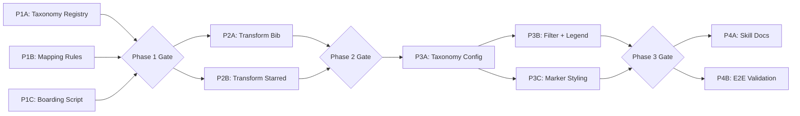

# Dev Plan — Unified Cuisine Taxonomy

> Dev unit size: 0.5 developer-day

## Architecture Summary

This plan implements the cuisine taxonomy PRD with a **skill-first** strategy: the reusable Python boarding script is built first, then used to produce the corrected data, then the frontend is adapted to consume canonical keys. This ensures the skill is the single source of truth for all data transformations — past and future.

**Key design decisions:**

| Decision | Rationale |
|----------|-----------|
| Taxonomy JSON lives in `public/data/taxonomy/` | Co-located with restaurant data; frontend can fetch at runtime if needed, or import at build-time. Single deployment unit. |
| Python boarding script at `skills/cuisine-boarding/` | Self-contained tool. Uses `uv` for deps. Reads taxonomy + raw data → outputs validated JSON. Reusable for any future guide. |
| Frontend reads taxonomy from static import | No runtime fetch. Taxonomy is small (< 2KB). Build-time type safety via generated TypeScript. |
| No backend. No runtime mapping. | PRD contract: `cuisine_group` is pre-computed. Frontend trusts the data. |
| Color/style stays in frontend config | PRD explicitly excludes styling from taxonomy. Styling maps canonical keys → visual props. |

## Current State → Target State

```
CURRENT                              TARGET
─────────────────────────────────    ─────────────────────────────────
cuisineGroups.ts (8 Chinese keys)    taxonomy/hong-kong.json (13 canonical keys)
                                     taxonomy/hong-kong-mappings.json
bib-gourmand: cuisine_group =        bib-gourmand: cuisine_group = "CANTONESE"
  "粤菜 / 烧腊 / 港式小馆"
starred: cuisine_group = cuisine     starred: cuisine_group = "FRENCH"
  (raw, ungrouped)                     (mapped from raw)
No pipeline                          skills/cuisine-boarding/ (Python CLI)
No ./skills/ directory               ./skills/ with reusable boarding tool
```

---

## Phase 1: Foundation — Taxonomy Data + Boarding Skill

| Track | Components | Owner | Deliverables | Dev Units | Depends On |
|-------|-----------|-------|--------------|-----------|------------|
| A — Taxonomy Registry | Data schema | Data | `public/data/taxonomy/hong-kong.json` with 13 canonical groups | 1 | — |
| B — Mapping Rules | Data schema | Data | `public/data/taxonomy/hong-kong-mappings.json` covering all known raw labels from both guides | 1 | — |
| C — Boarding Script | Pipeline tool | Script | `skills/cuisine-boarding/board.py` — Python CLI that reads taxonomy + mappings + raw data → outputs validated restaurant JSON with canonical `cuisine_group` | 1 | — |

### Track A — Taxonomy Registry

**Deliverable spec:**
- JSON file matching PRD §2 (Taxonomy Registry File Format)
- 13 groups with `key`, `labelZh`, `labelEn`, `sortOrder`
- `fallbackGroup: "OTHER"`

### Track B — Mapping Rules

**Deliverable spec:**
- JSON file matching PRD §3 (Mapping Rules)
- Must cover ALL distinct raw `cuisine` values from both current datasets:
  - Bib-gourmand: ~30 unique raw labels
  - Starred: ~23 unique raw labels + empty string
- Include `sources[]` metadata for auditability

### Track C — Boarding Script

**Deliverable spec:**
- Single Python script (`board.py`) with CLI interface via `argparse`
- Input: `--taxonomy <path>` `--mappings <path>` `--input <raw-json>` `--output <output-json>`
- Logic: load taxonomy → load mappings → for each restaurant: resolve `cuisine` → set `cuisine_group`
- Validation: every output `cuisine_group` in canonical enum; fallback rate ≤ 5%; emit warnings for unmapped
- Dependencies managed via `skills/cuisine-boarding/pyproject.toml` (minimal: no external deps beyond stdlib)
- Exit code 0 = success, 1 = validation failure

**Gate 1:** Taxonomy + mappings JSON pass schema validation. Boarding script runs on both datasets without error. Coverage: 0 unmapped labels for known data.

---

## Phase 2: Data Transformation (Parallel Tracks)

| Track | Components | Owner | Deliverables | Dev Units | Depends On |
|-------|-----------|-------|--------------|-----------|------------|
| A — Transform Bib-Gourmand | Data | Data | Updated `public/data/hong-kong/michelin-bib-gourmand.json` with canonical `cuisine_group` keys | 1 | Phase 1 Gate |
| B — Transform Starred | Data | Data | Updated `public/data/hong-kong/michelin-starred.json` with canonical `cuisine_group` keys (from raw `cuisine`) | 1 | Phase 1 Gate |

### Track A — Transform Bib-Gourmand

- Bib-gourmand currently has Chinese meta-group labels in `cuisine_group` (e.g., `"粤菜 / 烧腊 / 港式小馆"`)
- Must re-map using the raw `cuisine` field → canonical key via boarding script
- All 70 restaurants must resolve to a canonical group

### Track B — Transform Starred

- Starred currently has `cuisine_group === cuisine` (no grouping applied)
- Must map all 77 restaurants using the raw `cuisine` field
- ~18 records have empty `cuisine` (due to missing detail URLs) → map to `OTHER`
- Compound values (e.g., `"时尚法国菜, 创新菜"`) → exact match first, then first-token fallback

**Gate 2:** Both output JSONs pass validation. Every `cuisine_group` value exists in taxonomy registry. Fallback rate ≤ 5% per dataset. Data files committed.

---

## Phase 3: Frontend Refactor (Parallel Tracks)

| Track | Components | Owner | Deliverables | Dev Units | Depends On |
|-------|-----------|-------|--------------|-----------|------------|
| A — Taxonomy Config Module | `src/config/` | FE | New `src/config/cuisineRegistry.ts` — imports taxonomy JSON, exports typed registry + style map. Replaces `cuisineGroups.ts`. | 1 | Phase 2 Gate |
| B — Filter + Legend | `src/components/`, `src/hooks/` | FE | `useFilters.ts`, `FilterPanel.tsx`, `Legend.tsx` consume canonical registry. Dynamic group list derived from loaded data. | 1 | Track A |
| C — Marker Styling | `src/components/` | FE | `RestaurantMarker.ts` looks up style by canonical key. Fallback to `OTHER` style for unknown keys. | 1 | Track A |

### Track A — Taxonomy Config Module

**Deliverable spec:**
- Delete `cuisineGroups.ts`
- New `cuisineRegistry.ts`:
  - Imports `public/data/taxonomy/hong-kong.json` (Vite JSON import)
  - Exports `CuisineGroup` type, `cuisineRegistry: CuisineGroup[]`, `cuisineStyleMap: Record<string, {color, textColor}>`
  - Style assignments (hex colors) for each of the 13 canonical keys
  - Typed: `GroupKey` union type from registry keys

### Track B — Filter + Legend

**Deliverable spec:**
- `useFilters.ts`: `allGroups` derived from loaded restaurant data's distinct `cuisine_group` values (not from static enum). Initial state = all active.
- `FilterPanel.tsx`: Renders group chips from taxonomy registry (filtered to groups present in current dataset). Uses `labelZh` for display. Sorted by `sortOrder`.
- `Legend.tsx`: Same derivation — only shows groups with ≥1 restaurant in active dataset.

### Track C — Marker Styling

**Deliverable spec:**
- `RestaurantMarker.ts`: Lookup `cuisineStyleMap[restaurant.cuisine_group]` → apply color. Fallback to `cuisineStyleMap["OTHER"]`.

**Gate 3:** `npm run build` succeeds. No TypeScript errors. Both guides render all restaurants with correct colors on the map. Filter panel shows appropriate groups per guide.

---

## Phase 4: Skill Packaging + Integration Validation

| Track | Components | Owner | Deliverables | Dev Units | Depends On |
|-------|-----------|-------|--------------|-----------|------------|
| A — Skill Documentation | Skill | Ops | `skills/cuisine-boarding/SKILL.md` — usage instructions, input/output contract, example invocations for onboarding a new guide | 1 | Phase 3 Gate |
| B — End-to-End Validation | QA | QA | Manual verification: switch between bib-gourmand and starred guides → all markers visible, filters functional, no blank map | 1 | Phase 3 Gate |

### Track A — Skill Documentation

**Deliverable spec:**
- `SKILL.md` covers:
  - Purpose: onboard new Michelin guide data into the foodie-map system
  - Prerequisites: Python 3.11+, uv
  - Step-by-step workflow: scrape → dry-run → extend mappings → validate → commit
  - CLI reference for `board.py`
  - How to extend taxonomy (add new group) vs. extend mappings (add new raw label)
  - Validation criteria (5% threshold, enum membership)

### Track B — End-to-End Validation

**Validation criteria:**
- Bib-gourmand: 70 restaurants rendered, filter chips match canonical groups present in data
- Starred: 77 restaurants rendered (including `OTHER` for empty-cuisine records), filter chips match
- Switching guides updates filter panel dynamically
- No console errors related to unknown `cuisine_group`

**Gate 4 (Final):** Skill usable standalone (dry-run with sample data). Both guides fully functional in browser. Git commit with all changes.

---

## Summary Table

| Phase | Tracks | Total Dev Units | Gate Criteria |
|-------|--------|-----------------|---------------|
| Phase 1: Foundation | A: Taxonomy Registry, B: Mappings, C: Boarding Script | 3 | Taxonomy validates; script runs clean on both datasets |
| Phase 2: Data Transform | A: Bib-Gourmand, B: Starred | 2 | Both JSONs pass enum validation; ≤5% fallback |
| Phase 3: Frontend Refactor | A: Config Module, B: Filter+Legend, C: Marker | 3 | `npm run build` clean; both guides render |
| Phase 4: Skill + Validation | A: Skill Docs, B: E2E Check | 2 | Skill standalone; zero-marker bug gone |
| **Total** | | **10** | |

## Dev Unit Metrics

| Metric | Value |
|--------|-------|
| Total dev units | 10 |
| Max parallel tracks | 3 (Phase 1, Phase 3) |
| Phases | 4 |
| Critical path length | 7 dev units (P1C → P2B → P3A → P3B → P4B) |

## Dependency Graph



**Critical path:** P1C → G1 → P2B → G2 → P3A → P3B → G3 → P4B

## Text Fallback

```
Phase 1 (Foundation)  [3 dev units]
  ├─ Track A: Taxonomy Registry
  ├─ Track B: Mapping Rules
  └─ Track C: Boarding Script
      └─→ Phase 2 (Data Transform)  [2 dev units]
          ├─ Track A: Transform Bib-Gourmand
          └─ Track B: Transform Starred
              └─→ Phase 3 (Frontend Refactor)  [3 dev units]
                  ├─ Track A: Taxonomy Config Module
                  ├─ Track B: Filter + Legend (depends on A)
                  └─ Track C: Marker Styling (depends on A)
                      └─→ Phase 4 (Skill + Validation)  [2 dev units]
                          ├─ Track A: Skill Documentation
                          └─ Track B: E2E Validation
```

---

## File Impact Summary

| Action | Path | Description |
|--------|------|-------------|
| **CREATE** | `public/data/taxonomy/hong-kong.json` | Canonical group registry (13 groups) |
| **CREATE** | `public/data/taxonomy/hong-kong-mappings.json` | Raw→canonical mapping table |
| **CREATE** | `skills/cuisine-boarding/SKILL.md` | Reusable boarding skill documentation |
| **CREATE** | `skills/cuisine-boarding/board.py` | Data transformation pipeline script |
| **CREATE** | `skills/cuisine-boarding/pyproject.toml` | Python project definition |
| **CREATE** | `src/types/taxonomy.ts` | TypeScript types for taxonomy |
| **MODIFY** | `public/data/hong-kong/michelin-bib-gourmand.json` | Rewrite `cuisine_group` to canonical keys |
| **MODIFY** | `public/data/hong-kong/michelin-starred.json` | Rewrite `cuisine_group` to canonical keys |
| **REPLACE** | `src/config/cuisineGroups.ts` | Static map → dynamic taxonomy loader (`cuisineRegistry.ts`) |
| **MODIFY** | `src/hooks/useFilters.ts` | Init from taxonomy keys |
| **MODIFY** | `src/components/FilterPanel.tsx` | Render from taxonomy groups |
| **MODIFY** | `src/components/Legend.tsx` | Derive from taxonomy |
| **MODIFY** | `src/components/RestaurantMarker.ts` | Lookup from taxonomy styleMap |
| **MODIFY** | `src/components/MobilePopupCard.tsx` | Lookup from taxonomy styleMap |

---

## Risk Register

| Risk | Probability | Impact | Mitigation |
|------|-------------|--------|------------|
| Starred data has raw labels not covered by PRD mapping table | Medium | High | Run Python script in dry-run first; log all unmapped labels; extend mappings before committing |
| ~18 starred restaurants have empty `cuisine` + missing URLs | High | Medium | Acceptable per PRD (≤5% OTHER). These are placeholder records without Michelin detail pages. |
| Compound cuisine labels (e.g., "时尚法国菜, 创新菜") | Medium | Low | PRD defines exact-match-first + first-token fallback. Boarding script implements this. |
| Color assignments for new groups clash with existing palette | Low | Low | Assign complementary colors upfront; visual differentiation per cuisine type |
| Frontend fetch of taxonomy JSON adds loading time | Low | Low | Taxonomy JSON is tiny (<2KB); static import at build time eliminates runtime cost |
| `cuisineGroups.ts` imports in 8+ files | Medium | Medium | Systematic replacement in Phase 3 Track B; each consumer listed with specific change |

---

## Acceptance Criteria Mapping

| AC | Description | Covered By |
|----|-------------|------------|
| AC-1 | Bib-gourmand: 100% mapped to canonical enum | P1-C validation + P2-A |
| AC-2 | Starred: 100% mapped, ≤ 5% OTHER | P1-C validation + P2-B |
| AC-3 | No zero-marker bug on guide switch | P3-B + P3-C + P4-B |
| AC-4 | Unknown label → OTHER + warning | P1-C pipeline logic |
| AC-5 | Invalid group → build fail | P1-C validation logic |
| AC-6 | Filter chips match canonical labels | P3-B |

---

## Implementation Wisdom Notes

### Why Skill-First?

Building the boarding script **before** transforming data means:
1. The transformation is reproducible — if source data updates, re-run the same tool
2. The skill is battle-tested on real data before being packaged
3. Future guides (Michelin Plate, Asia's 50 Best) use the exact same flow

### Why Not a Runtime Mapper?

The PRD is explicit: `cuisine_group` is pre-computed. But even beyond PRD compliance:
- Zero runtime cost (no mapping logic in bundle)
- Data is self-describing (open the JSON → see the group)
- Validation happens at build-time, not when users see a broken map

### Frontend Refactor Strategy

The minimal change set:
1. Replace `cuisineGroups.ts` (a 19-line file) with a new registry that maps canonical keys → colors
2. Update 4 consumers (FilterPanel, Legend, useFilters, RestaurantMarker) — all < 100 lines each
3. Dynamic filter derivation = never hard-code group lists again

### Skill Reusability Contract

The `skills/cuisine-boarding/` directory is designed to be self-contained:

```
skills/cuisine-boarding/
├── SKILL.md              # Human/AI readable usage guide
├── board.py              # The pipeline script (stdlib only)
├── pyproject.toml        # uv-compatible project definition
└── tests/
    └── test_board.py     # Smoke test with sample data
```

Any maintainer (or AI agent) can:
1. `cd skills/cuisine-boarding && uv run board.py --help`
2. Follow SKILL.md to onboard new guide data
3. Extend mappings without touching any frontend code

---

## Appendix: Color Assignment for New Groups

| Group Key | Color (hex) | Text Color | Notes |
|-----------|-------------|------------|-------|
| CANTONESE | #D64C4C | #fff | Migrated from existing "粤菜" |
| NOODLES_CONGEE | #E1B93A | #1a1a1a | Migrated from existing "面食" |
| DIM_SUM | #43A36B | #fff | Migrated from existing "点心" |
| REGIONAL_CHINESE | #8A57C9 | #fff | Merged from 潮州/客家/顺德 + 京沪/川菜 |
| SOUTHEAST_ASIAN | #4386D6 | #fff | Migrated from existing "东南亚" |
| JAPANESE | #2B2B2B | #fff | Migrated from existing "日料" |
| KOREAN | #5C6BC0 | #fff | New — indigo, differentiates from Japanese |
| FRENCH | #B8860B | #fff | New — dark gold, European elegance |
| ITALIAN_EUROPEAN | #E0823F | #fff | New — warm orange |
| WESTERN_OTHER | #8C8F96 | #fff | Migrated from existing "西餐" |
| INNOVATIVE | #00897B | #fff | New — teal, modern cuisine |
| STEAKHOUSE_GRILL | #6D4C41 | #fff | New — brown, meat/fire association |
| OTHER | #BDBDBD | #1a1a1a | Neutral gray for fallback |
