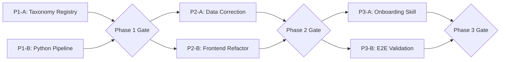

# Dev Plan — Unified Cuisine Taxonomy (Candidate 3)

> Dev unit size: 0.5 developer-day

## Situation Summary

| Item | Current State |
|------|---------------|
| Bib-gourmand (70 records) | `cuisine_group` uses 8 static composite keys (e.g., "粤菜 / 烧腊 / 港式小馆") matching `cuisineGroups.ts` |
| Starred (77 records) | `cuisine_group` = raw `cuisine` label (e.g., "时尚法国菜") — **zero overlap** with static keys |
| Filter logic | `activeGroups.has(r.cuisine_group)` against static 8-key set → starred shows nothing |
| Taxonomy files | Do not exist |
| Pipeline scripts | Do not exist |
| Onboarding skill | Does not exist |

## Strategy: Candidate 3 — Pipeline-First with Local Skill

**Core insight:** The fastest path to correctness is:
1. Create the taxonomy + mapping registry as the single source of truth
2. Write a Python pipeline that re-stamps `cuisine_group` in both data files in-place
3. Refactor the frontend to derive groups dynamically from taxonomy (not static config)
4. Capture the onboarding workflow as a reusable local skill

**Why Candidate 3 differs from naive approaches:**
- Does NOT regenerate data from scratch (no scraper needed — raw data already exists in JSON)
- Pipeline operates as a **re-mapping pass** over existing JSON files (read → map → write back)
- Frontend refactor is minimal — replace the source of `cuisineGroups` with taxonomy-derived config, keep the same component structure
- Skill is built from the actual pipeline experience (not speculative)

---

## Phase 1: Foundation — Taxonomy Registry + Mapping Pipeline

| Track | Components | Owner | Deliverables | Dev Units | Depends On |
|---|---|---|---|---|---|
| A: Taxonomy Registry | `taxonomy/hong-kong.json`, `taxonomy/hong-kong-mappings.json` | Data | Two JSON files conforming to PRD schema; all 13 groups defined; all known raw labels mapped | 1 | — |
| B: Python Pipeline | `scripts/apply_taxonomy.py` | Pipeline | Script that reads taxonomy + guide JSON → re-stamps `cuisine_group` → validates → writes output | 1 | — |

### Track A: Taxonomy Registry

**Deliverables:**
- `taxonomy/hong-kong.json` — 13 canonical groups with `key`, `labelZh`, `labelEn`, `sortOrder`, `color`, `textColor`
- `taxonomy/hong-kong-mappings.json` — All raw cuisine labels from both bib-gourmand and starred datasets mapped to canonical keys

**Implementation notes:**
- Colors migrate from current `cuisineGroups.ts` (mapped to the closest new canonical group)
- New groups (`INNOVATIVE`, `STEAKHOUSE_GRILL`, `KOREAN`) get new colors that visually differentiate
- Every unique `cuisine` value from both JSON files must appear in mappings (audit against actual data)
- Include the `拉丁美洲菜` and `时尚法国菜, 创新菜` compound values found in starred data

### Track B: Python Pipeline (`scripts/apply_taxonomy.py`)

**Deliverables:**
- Single Python script (no external deps beyond stdlib + json)
- CLI: `python scripts/apply_taxonomy.py --city hong-kong [--dry-run]`
- Reads `taxonomy/hong-kong.json` + `taxonomy/hong-kong-mappings.json`
- Iterates each JSON file in `public/data/hong-kong/`
- For each restaurant: looks up `cuisine` in mappings → sets `cuisine_group` to canonical key
- Multi-value handling: exact match first, then split by `, ` and resolve first token
- Empty/missing → `OTHER` + warning
- Unknown → `OTHER` + warning
- Validates: all `cuisine_group` values in output exist in canonical enum
- Validates: ≤ 5% fallback to `OTHER`
- `--dry-run` mode: print mapping summary without writing files

**Gate:** Taxonomy files parse correctly. Pipeline runs in `--dry-run` mode against current data without crash. Summary shows 100% mapping coverage for bib-gourmand and ≤ 5% OTHER for starred.

---

## Phase 2: Data Correction + Frontend Refactor

| Track | Components | Owner | Deliverables | Dev Units | Depends On |
|---|---|---|---|---|---|
| A: Data Correction | `public/data/hong-kong/*.json` | Pipeline | Both guide JSONs re-stamped with canonical `cuisine_group` values | 1 | Phase 1 Gate |
| B: Frontend Refactor | `src/config/cuisineGroups.ts`, `useFilters.ts`, `FilterPanel.tsx`, `Legend.tsx`, `RestaurantMarker.ts`, `MobilePopupCard.tsx` | Frontend | Filter panel + legend + markers derive groups from taxonomy; no static key dependency | 1 | Phase 1 Track A |

### Track A: Data Correction

**Deliverables:**
- Run pipeline (non-dry-run) → `michelin-bib-gourmand.json` gets canonical keys (CANTONESE, NOODLES_CONGEE, etc.)
- Run pipeline → `michelin-starred.json` gets canonical keys (currently raw labels → now canonical)
- Validation passes for both files
- Git diff shows only `cuisine_group` field changes (no other fields modified)

### Track B: Frontend Refactor

**Deliverables:**
- Replace `cuisineGroups.ts` content: instead of hard-coded map, **import and parse** `taxonomy/hong-kong.json` at build time (Vite JSON import) or bundle a TypeScript-typed constant derived from it
- `useFilters.ts`: `allGroups` derived from taxonomy groups (keys), not static object keys
- `FilterPanel.tsx`: render taxonomy `groups[]` in `sortOrder`; use `labelZh` as chip text; show only groups with ≥1 restaurant in current dataset
- `Legend.tsx`: same dynamic derivation
- `RestaurantMarker.ts` + `MobilePopupCard.tsx`: lookup color by `cuisine_group` key against taxonomy (fallback to OTHER group style)
- No behavior change for bib-gourmand (still shows correctly after re-keying)
- Starred data now renders all 77 markers with correct group colors

**Implementation approach:**
- Copy `taxonomy/hong-kong.json` into `src/config/taxonomy-hong-kong.json` (or Vite public import)
- Generate a `CuisineGroupMap` at module level from taxonomy groups array
- Keep the `CuisineGroupStyle` type (`{ color: string; text: string }`) — just derive the map differently
- Filter chips only show groups that exist in the currently loaded dataset (dynamic count)

**Gate:** `npm run build` succeeds. Both guides render markers. Switching guides shows all restaurants. Filter chips match canonical labels. No TypeScript errors.

---

## Phase 3: Onboarding Skill + Validation

| Track | Components | Owner | Deliverables | Dev Units | Depends On |
|---|---|---|---|---|---|
| A: Onboarding Skill | `./skills/cuisine-data-onboarding.md` | DevX | Local skill document covering the full workflow for adding a new guide dataset | 1 | Phase 2 Gate |
| B: E2E Validation | Manual + existing test | QA | Both guides confirmed working; acceptance criteria verified | 1 | Phase 2 Gate |

### Track A: Onboarding Skill (`./skills/cuisine-data-onboarding.md`)

**Deliverables:**
- A SKILL.md file in `./skills/` directory
- Covers the end-to-end workflow for boarding new restaurant data into the system
- Sections: prerequisites, input format, step-by-step process, validation checks, common errors
- Includes: how to identify unmapped cuisines, how to extend mappings, how to re-run pipeline, how to verify frontend renders correctly
- References the taxonomy files and pipeline script by path
- Actionable by an AI agent or a human developer

**Skill scope:**
1. Accept raw restaurant JSON (any guide) with at minimum: `name`, `cuisine`, `lat`, `lon`
2. Run dry-run pipeline → identify unmapped cuisines
3. Extend `hong-kong-mappings.json` with new raw→canonical rules
4. Run pipeline → validate
5. Verify frontend renders (build + visual check)
6. Register new guide in `cities.ts` if needed

### Track B: E2E Validation

**Deliverables:**
- Verify AC-1: Bib-gourmand 100% mapped to canonical enum ✓
- Verify AC-2: Starred 100% mapped, ≤ 5% OTHER ✓
- Verify AC-3: Switching guides shows all markers (no zero-marker bug) ✓
- Verify AC-6: Filter chips match canonical labels, counts accurate ✓
- Run existing Puppeteer test suite (`tests/title-filter.test.mjs`) — passes
- Visual spot-check: select specific starred restaurants, confirm correct group assignment

**Gate:** All acceptance criteria pass. Puppeteer tests green. Skill file exists and is self-consistent.

---

## Summary Table

| Phase | Tracks | Total Dev Units | Gate Criteria |
|---|---|---|---|
| Phase 1: Foundation | A: Taxonomy Registry, B: Python Pipeline | 2 | Pipeline dry-run passes with full mapping coverage |
| Phase 2: Data + Frontend | A: Data Correction, B: Frontend Refactor | 2 | Build succeeds; both guides render all markers |
| Phase 3: Skill + Validation | A: Onboarding Skill, B: E2E Validation | 2 | ACs pass; skill file complete |
| **Total** | | **6** | |

## Dev Unit Metrics

| Metric | Value |
|---|---|
| Total dev units | 6 |
| Max parallel tracks | 2 |
| Phases | 3 |
| Critical path length | 4 dev units (P1A → P2B → P3B or P1B → P2A → P3B) |

## Dependency Graph



**Critical path:** P1-B → P2-A → P3-B (pipeline must work before data can be corrected, data must be correct before E2E validates)

## Text Fallback

```
Phase 1 (Foundation)  [2 dev units]
  ├─ Track A: Taxonomy Registry  [1 du]
  └─ Track B: Python Pipeline    [1 du]  (parallel)
      Phase 1 Gate: dry-run passes
          │
Phase 2 (Data + Frontend)  [2 dev units]
  ├─ Track A: Data Correction    [1 du]
  └─ Track B: Frontend Refactor  [1 du]  (parallel)
      Phase 2 Gate: build + render
          │
Phase 3 (Skill + Validation)  [2 dev units]
  ├─ Track A: Onboarding Skill   [1 du]
  └─ Track B: E2E Validation     [1 du]  (parallel)
      Phase 3 Gate: ACs pass
```

---

## Appendix: Color Assignment for New Groups

| Group Key | Color (hex) | Text Color | Source |
|---|---|---|---|
| CANTONESE | #D64C4C | #fff | Migrated from "粤菜 / 烧腊 / 港式小馆" |
| NOODLES_CONGEE | #E1B93A | #1a1a1a | Migrated from "面食 / 云吞 / 车仔面" |
| DIM_SUM | #43A36B | #fff | Migrated from "点心 / 茶楼" |
| REGIONAL_CHINESE | #8A57C9 | #fff | Migrated from "潮州 / 客家 / 顺德" + "京沪 / 上海 / 川菜" (merged) |
| SOUTHEAST_ASIAN | #4386D6 | #fff | Migrated from "东南亚 / 印度 / 泰 / 越" |
| JAPANESE | #2B2B2B | #fff | Migrated from "日料 / 韩餐" |
| KOREAN | #5C6BC0 | #fff | New — indigo to differentiate from Japanese |
| FRENCH | #B8860B | #fff | New — dark gold, European elegance |
| ITALIAN_EUROPEAN | #E0823F | #fff | Migrated from "京沪 / 上海 / 川菜" slot (repurposed) |
| WESTERN_OTHER | #8C8F96 | #fff | Migrated from "西餐 / 其他" |
| INNOVATIVE | #00897B | #fff | New — teal, modern cuisine |
| STEAKHOUSE_GRILL | #6D4C41 | #fff | New — brown, meat/fire association |
| OTHER | #BDBDBD | #1a1a1a | New — neutral gray |

## Appendix: Starred Data Mapping Coverage

All unique `cuisine` values from `michelin-starred.json` and their canonical mapping:

| Raw Cuisine | → Canonical Group | Notes |
|---|---|---|
| 粤菜 | CANTONESE | ~16 restaurants |
| 时尚法国菜 | FRENCH | ~8 restaurants |
| 创新菜 | INNOVATIVE | ~4 restaurants |
| 意大利菜 | ITALIAN_EUROPEAN | ~4 restaurants |
| 日本菜 | JAPANESE | ~4 restaurants |
| 寿司 | JAPANESE | ~3 restaurants |
| 法国菜 | FRENCH | ~2 restaurants |
| 沪菜 | REGIONAL_CHINESE | ~2 restaurants |
| 点心 | DIM_SUM | |
| 潮州菜 | REGIONAL_CHINESE | |
| 印度菜 | SOUTHEAST_ASIAN | |
| 印度菜, 巴基斯坦菜 | SOUTHEAST_ASIAN | Atomic match |
| 韩国菜 | KOREAN | |
| 粥面 | NOODLES_CONGEE | |
| 铁板烧 | JAPANESE | |
| 海鲜 | OTHER | |
| 扒房 | STEAKHOUSE_GRILL | |
| 时尚欧陆菜 | ITALIAN_EUROPEAN | |
| 拉丁美洲菜 | WESTERN_OTHER | Not in PRD mappings — add |
| 时尚亚洲菜 | SOUTHEAST_ASIAN | |
| 台州菜 | REGIONAL_CHINESE | |
| 鸡肉串烧 | JAPANESE | |
| 宁波菜 | REGIONAL_CHINESE | |
| 顺德菜 | REGIONAL_CHINESE | |
| 时尚法国菜, 创新菜 | FRENCH | Atomic match; or first-token fallback → FRENCH |
| _(empty)_ | OTHER | ~20 restaurants (high!) |

**Concern:** ~20 empty `cuisine` values in starred data = ~26%. This exceeds the 5% threshold. **Resolution:** Investigate whether these can be manually enriched from the Michelin website. If not, the 5% rule must be relaxed for the initial import, or these records need manual `cuisine` backfill. **Recommendation:** Treat empty-cuisine starred records as a known data quality issue; set their `cuisine_group` based on manual review or mark as OTHER with a pipeline override flag for the initial run.

## Appendix: Skill File Structure

The `./skills/cuisine-data-onboarding.md` skill will follow this structure:

```
---
name: cuisine-data-onboarding
description: Onboard new restaurant guide data into the foodie-map taxonomy system
triggers: [new guide, new data, onboard, cuisine mapping]
---

# Cuisine Data Onboarding

## When to Use
- Adding a new Michelin guide (Plate, Green Star, etc.)
- Adding a new city's data
- Annual data refresh for existing guides

## Prerequisites
- Raw restaurant JSON with: name, cuisine, lat, lon (minimum)
- Python 3.10+ available
- Taxonomy files exist in taxonomy/

## Workflow
1. Place raw JSON in public/data/{city}/
2. Dry-run pipeline → identify unmapped cuisines
3. Extend mappings → re-run until 0 warnings (or ≤ 5% OTHER)
4. Run pipeline (non-dry-run) → stamps cuisine_group
5. Register guide in src/config/cities.ts
6. Build frontend → verify render
7. Commit

## Validation Checklist
- [ ] All cuisine_group values in canonical enum
- [ ] ≤ 5% map to OTHER
- [ ] Filter chips render correctly
- [ ] Markers visible for all geocoded records
```
