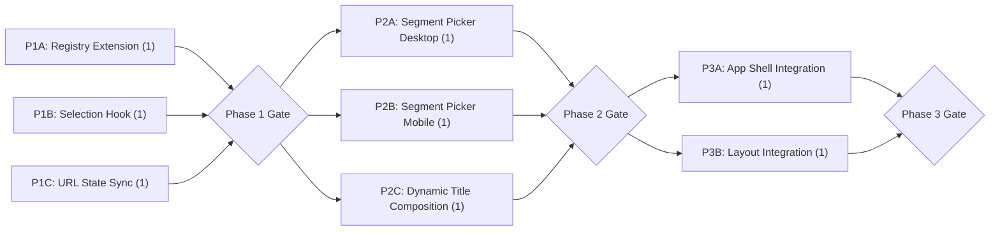

# Foodie Map — Dynamic Title Switcher Dev Plan

> Dev unit size: 0.5 developer-day

## Context

Add a dynamic title switcher to the foodie-map app. The title follows the formula `{year} {location} · {guideName}餐厅地图` with three independently switchable segments rendered as inline pill selectors. Switching a segment cascades dependent segments and reloads map data. The feature must work on both desktop (dropdown) and mobile (bottom-sheet), sync state to the URL, and derive all options from the existing `cities.ts` registry — zero hardcoded lists in UI code.

### Current State

- Title is hardcoded in `App.tsx`; city/guide selection is `cities[0]`/`city.guides[0]`.
- `CityConfig`/`GuideConfig` models exist but lack `labelZh` and `year` fields.
- No routing or URL state management exists.
- No global state management — all state is prop-drilled from `App.tsx`.
- No generic dropdown/selector component exists. `BottomSheet` component exists for mobile panels.
- `Header` is a pure presentational component accepting `title`/`subtitle` strings.

---

## Contracts

| Contract | Producer | Consumer |
|----------|----------|----------|
| Extended `CityConfig` / `GuideConfig` registry (with `labelZh`, `year`) | Config registry | Selection hook, Title component |
| Selection state (active year, location, guideName → resolved `dataPath`) | Selection hook | App shell, Title component, URL sync |
| Available-options derivation (years, locations, guides per current selection) | Selection hook | Title segment pickers |
| Cascading reset rules (year → location → guide) | Selection hook | Title segment pickers |
| URL ↔ selection sync (read on mount, write on change) | URL sync module | Selection hook |
| Segment picker interaction (options list, selected value, onChange) | Title component | Segment picker UI |

---

## Phase 1: Foundation — Registry & Selection Logic

| Track | Components | Owner | Deliverables | Dev Units | Depends On |
|---|---|---|---|---|---|
| A: Registry Extension | City/guide config model, registry data | — | `CityConfig` and `GuideConfig` interfaces extended with `labelZh` and `year`; registry populated with current + any additional test entries | 1 | — |
| B: Selection Hook | Selection state, option derivation, cascade logic | — | Hook that manages active (year, location, guideName) tuple; derives available options per segment from registry; applies cascade resets on segment change; resolves selection to a `dataPath` | 1 | — |
| C: URL State Sync | URL ↔ selection bridge | — | Module that reads selection from URL search params on mount and writes params on selection change; handles invalid/missing params by falling back to first valid option per segment | 1 | — |

**Gate:** Selection hook returns correct available options and applies cascade logic for all registry combinations. URL sync round-trips: setting params → reading back produces same selection. All contracts type-checked.

---

## Phase 2: UI Components — Pickers & Title

| Track | Components | Owner | Deliverables | Dev Units | Depends On |
|---|---|---|---|---|---|
| A: Segment Picker (Desktop) | Inline pill + dropdown | — | Generic segment picker: renders as a chip with caret; click opens dropdown below; single-option mode renders as static text (no caret); supports keyboard dismiss (Escape) and click-outside close | 1 | Phase 1 Gate |
| B: Segment Picker (Mobile) | Bottom-sheet selector variant | — | Mobile-adapted segment picker leveraging existing bottom-sheet component; opens segment options in a stacked bottom-sheet panel on tap; same data contract as desktop picker | 1 | Phase 1 Gate |
| C: Dynamic Title Composition | Title bar component | — | Composes three segment pickers + static text (`·`, `餐厅地图` suffix) following the formula; desktop renders inline pills, mobile renders compact single-line with expandable sheet; passes selection changes up via callback | 1 | Phase 1 Gate |

**Gate:** Title renders with three interactive segments on desktop. Mobile layout renders compact title with bottom-sheet picker. Single-option segments display as static text. Visual styling matches design spec (chip bg, hover, active ring).

---

## Phase 3: Integration & Data Wiring

| Track | Components | Owner | Deliverables | Dev Units | Depends On |
|---|---|---|---|---|---|
| A: App Shell Integration | App root, data fetching | — | Replace hardcoded `cities[0]`/`guides[0]` with selection hook output; data fetch driven by resolved `dataPath` from selection; in-flight fetch aborted on rapid segment switching (only latest selection rendered); document title updated dynamically | 1 | Phase 2 Gate |
| B: Layout Integration | Header, MobileShell | — | Replace static `title` string prop with dynamic title component in both desktop header and mobile shell; existing subtitle logic preserved | 1 | Phase 2 Gate |

**Gate:** Switching any segment updates the title, triggers correct data fetch, and renders matching restaurants on the map. Rapid switching (3× consecutive) results in only the final selection's data displayed. URL reflects active selection; navigating to a URL with valid params restores that state. Document `<title>` updates to match.

---

## Summary

| Phase | Tracks | Total Dev Units | Gate Criteria |
|---|---|---|---|
| Phase 1: Foundation | A: Registry Extension, B: Selection Hook, C: URL State Sync | 3 | Selection + cascade logic correct; URL sync round-trips; types compile |
| Phase 2: UI Components | A: Segment Picker (Desktop), B: Segment Picker (Mobile), C: Dynamic Title Composition | 3 | Interactive pills on desktop; bottom-sheet on mobile; single-option static rendering |
| Phase 3: Integration | A: App Shell Integration, B: Layout Integration | 2 | End-to-end switching works; fetch cancellation on rapid switch; URL deep-link; document title updates |
| **Total** | | **8** | |

## Dev Unit Metrics

| Metric | Value |
|---|---|
| Total dev units | 8 |
| Max parallel tracks | 3 (Phase 1 and Phase 2) |
| Phases | 3 |
| Critical path length | 3 dev units (P1-B → P2-C → P3-A) |

## Dependency Graph



**Critical path:** P1-B (Selection Hook) → P2-C (Dynamic Title Composition) → P3-A (App Shell Integration) = 3 dev units

### Text Fallback

```
Phase 1 (Foundation)  [3 dev units]
  ├─→ Track A: Registry Extension   [1 dev unit]
  ├─→ Track B: Selection Hook       [1 dev unit]  (parallel)
  └─→ Track C: URL State Sync       [1 dev unit]  (parallel)
        ↓ Gate: cascade logic + URL round-trip + types
Phase 2 (UI Components)  [3 dev units]
  ├─→ Track A: Segment Picker Desktop   [1 dev unit]
  ├─→ Track B: Segment Picker Mobile    [1 dev unit]  (parallel)
  └─→ Track C: Dynamic Title Comp      [1 dev unit]  (parallel)
        ↓ Gate: interactive pills + mobile sheet + static single-option
Phase 3 (Integration)  [2 dev units]
  ├─→ Track A: App Shell Integration   [1 dev unit]
  └─→ Track B: Layout Integration      [1 dev unit]  (parallel)
        ↓ Gate: end-to-end switching + fetch abort + URL deep-link
```

---

## Key Architectural Decisions (for implementer reference)

1. **Selection as a hook, not a context/store.** The selection state is managed in a single hook called from `App.tsx` and prop-drilled down. This matches the existing state management pattern (no global store, no context) and is sufficient given the small component tree depth. If future features introduce more consumers, upgrade to context.
2. **Registry as single source of truth.** All picker options are derived at runtime from `cities.ts`. Adding a city/year/guide requires only a registry entry and a data file — zero UI code changes.
3. **URL state via search params, not a router.** The app has no routing library. Selection state syncs to `?year=2026&city=hong-kong&guide=michelin-bib-gourmand` using the History API directly. This satisfies the deep-link requirement without introducing a routing dependency.
4. **Generic picker component with layout variants.** A single segment picker data contract serves both desktop (inline dropdown) and mobile (bottom-sheet) modes. The dynamic title component selects the appropriate variant based on viewport, reusing the existing `useViewport` hook and `BottomSheet` component.
5. **Fetch abort on rapid switching.** `useGuideData` hook is extended with an `AbortController` pattern — each new `dataPath` change aborts the previous in-flight request. This prevents race conditions without external state management.
6. **No backward compatibility.** The hardcoded title in `App.tsx` and the static `<title>` in `index.html` are replaced outright.

---

## Risks & Mitigations

- **Cascade logic complexity:** Three interdependent segments with conditional availability could introduce subtle bugs. Mitigation: selection hook is a pure function of (registry, currentSelection, changedSegment) — unit-testable in isolation without rendering.
- **Mobile bottom-sheet reuse:** The existing `BottomSheet` component is designed for tabbed panels (filter/stats/legend), not single-segment selection. Mitigation: if the existing component's snap-point and content model doesn't fit, build a lightweight variant rather than over-generalizing the existing one.
- **Single-entry registry edge case:** With only one city and one guide currently in the registry, all segments render as static text. The feature is visually invisible until a second entry is added. Mitigation: Phase 1 Track A includes a test entry to validate interactive behavior during development; remove or keep as desired after integration.
- **Dropdown positioning on narrow viewports:** Use `getBoundingClientRect` + flip logic in the dropdown; fallback to center-aligned if insufficient space.

---

## Testing Notes

| Phase | Test Focus |
|-------|------------|
| Phase 1 | Unit tests for selection hook cascade logic; verify option derivation returns correct filtered lists; URL sync round-trip tests |
| Phase 2 | Visual tests for pill states (default, hover, active, disabled/single-option); keyboard navigation in dropdown; a11y attributes (`aria-expanded`, `aria-selected`) |
| Phase 3 | Integration test: switch city → verify data fetch → verify map renders; rapid switch race condition test (3× consecutive → only final data displayed); deep-link URL test |
