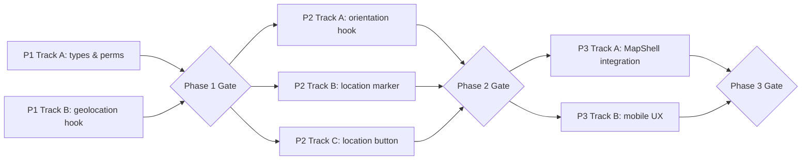

# Tech Dev Plan: Live User Location & Facing Direction

> Dev unit size: 0.5 developer-day

## Source Context

Feature: Show user's live location (blue dot) and facing direction (directional cone) on the existing Leaflet map. Mobile web gets full location + compass; desktop gracefully degrades to location-only.

**Architecture assumptions (inline tech brief — no separate tech design doc):**

| Component | Responsibility |
|---|---|
| `useGeolocation` hook | Wraps `navigator.geolocation.watchPosition`; exposes `{lat, lon, accuracy, error, permissionState}` |
| `useDeviceOrientation` hook | Wraps `DeviceOrientationEvent`; handles iOS 13+ permission request; exposes `{heading, supported}` |
| `UserLocationMarker` | Leaflet custom layer: pulsing blue dot + directional cone (rotated via CSS transform) |
| `LocationButton` | Map control button to trigger permission flow and toggle tracking on/off |
| Permission utilities | Thin helpers for `navigator.permissions.query` and iOS `DeviceOrientationEvent.requestPermission()` |

**Contracts between components:**

- `useGeolocation` → `UserLocationMarker`: `{ lat: number; lon: number; accuracy: number } | null`
- `useDeviceOrientation` → `UserLocationMarker`: `{ heading: number } | null` (degrees from north, `null` = unsupported/denied)
- `LocationButton` → hooks: triggers `start()`/`stop()` on both hooks
- `MapShell` owns the composition; `MobileShell` passes props through

### Type Contracts

```typescript
interface GeolocationState {
  lat: number | null;
  lon: number | null;
  accuracy: number | null;  // meters
  isActive: boolean;
  error: GeolocationPositionError | null;
}

interface OrientationState {
  heading: number | null;  // degrees from north, 0-360
  isSupported: boolean;
}
```

---

## Phase 1: Foundation

| Track | Components | Owner | Deliverables | Dev Units | Depends On |
|---|---|---|---|---|---|
| A: Types & Permission Utils | `src/types/geolocation.ts`, `src/utils/permissions.ts` | — | TypeScript interfaces for position/heading state; permission helper wrapping Geolocation + DeviceOrientation APIs; iOS 13+ `requestPermission` wrapper | 1 | — |
| B: Geolocation Hook | `src/hooks/useGeolocation.ts` | — | React hook exposing reactive `{position, accuracy, error, tracking}`. Uses `watchPosition` with throttle. Cleans up on unmount. | 1 | — |

**Gate:** Both tracks deliver typed, unit-testable modules with no map dependency. Hook can be verified in isolation via browser DevTools override.

---

## Phase 2: Orientation & Visual

| Track | Components | Owner | Deliverables | Dev Units | Depends On |
|---|---|---|---|---|---|
| A: Device Orientation Hook | `src/hooks/useDeviceOrientation.ts` | — | React hook exposing `{heading, supported, requestPermission()}`. Handles `deviceorientationabsolute` (Android) and `deviceorientation` + `webkitCompassHeading` (iOS). Graceful no-op on desktop. | 1 | Phase 1A (permission utils) |
| B: User Location Marker | `src/components/UserLocationMarker.ts` | — | Leaflet `L.Marker` subclass or custom `L.DivIcon` with: pulsing dot (CSS animation), accuracy circle (`L.Circle`), directional cone (rotatable SVG/CSS). Accepts `{lat, lon, accuracy, heading}`. | 1 | Phase 1A (types) |
| C: Location Button Control | `src/components/LocationButton.ts` | — | Leaflet `L.Control` subclass rendering a "locate me" button. Manages 3 states: `inactive` → `locating` → `tracking`. Emits `onActivate`/`onDeactivate`. | 1 | Phase 1A (types) |

**Gate:** Marker renders correctly with hardcoded test data on the map. Button triggers state transitions visually. Orientation hook logs heading to console on a mobile device.

---

## Phase 3: Integration & Polish

| Track | Components | Owner | Deliverables | Dev Units | Depends On |
|---|---|---|---|---|---|
| A: MapShell Integration | `src/components/MapShell.tsx` | — | Wire `LocationButton` as a Leaflet control, instantiate `UserLocationMarker`, connect both hooks. Add/remove marker on tracking state change. Update marker position/heading on hook state change. | 1 | Phase 2 (all) |
| B: Mobile UX | `src/components/MobileShell.tsx` | — | Ensure location button is accessible in mobile layout. Handle iOS permission prompt UX (must be triggered by user gesture). Test on Safari iOS. | 1 | Phase 2 (all) |

**Gate:** On mobile Safari: tap button → permission prompt → blue dot with cone appears and rotates with device. On desktop Chrome: tap button → blue dot appears, no cone. Stopping tracking removes marker.

---

## Summary

| Phase | Tracks | Total Dev Units | Gate Criteria |
|---|---|---|---|
| Phase 1: Foundation | A: Types & Perms, B: Geolocation Hook | 2 | Typed modules, hook verifiable in isolation |
| Phase 2: Orientation & Visual | A: Orientation Hook, B: Marker, C: Button | 3 | Marker renders with test data; orientation logs on mobile |
| Phase 3: Integration & Polish | A: MapShell, B: Mobile UX | 2 | End-to-end location + direction on mobile; graceful desktop fallback |
| **Total** | | **7** | |

## Dev Unit Metrics

| Metric | Value |
|---|---|
| Total dev units | 7 |
| Max parallel tracks | 3 (Phase 2) |
| Phases | 3 |
| Critical path length | 5 dev units (P1A → P2A → P3A, or P1A → P2B → P3A) |

## Dependency Graph



**Critical path:** P1A → P2B → P3A (types → marker visual → map integration)

## Key Technical Decisions

| Decision | Rationale |
|---|---|
| Leaflet `L.DivIcon` (not `L.circleMarker`) | Allows CSS animation for pulsing dot + rotatable SVG cone via `transform: rotate()`. GPU-accelerated via `will-change: transform`. |
| Separate hooks for geolocation vs orientation | Different permission models, different browser support. Clean separation enables independent testing. |
| `watchPosition` with `enableHighAccuracy: true` | GPS on mobile; on desktop falls back to Wi-Fi. Accuracy circle communicates uncertainty. |
| iOS `DeviceOrientationEvent.requestPermission()` gated by user gesture | Safari requirement since iOS 13. Must be called inside a click/tap handler. Chained after geolocation permission. |
| No external dependencies | All APIs are browser-native. No additional npm packages beyond Leaflet. |
| Imperative Leaflet integration | `UserLocationMarker` manages Leaflet layers directly (consistent with existing marker patterns), not via react-leaflet declarative components. |

## Risks & Mitigations

| Risk | Impact | Mitigation |
|---|---|---|
| iOS Safari blocks orientation without HTTPS | Feature dead on HTTP | Already deploying via GitHub Pages (HTTPS) |
| GPS flicker / low accuracy indoors (urban canyon near HK high-rises) | Jittery dot | Position smoothing (exponential moving average) + minimum movement threshold; accuracy ring shows uncertainty |
| Battery drain from continuous `watchPosition` + orientation listener | Poor mobile UX | Auto-stop after 5 min inactivity; pause listeners on `visibilitychange` (app backgrounded); throttle orientation to 100ms intervals |
| Desktop has no compass hardware | Partial feature | Graceful degradation — show dot only, hide cone; strict feature detection (`heading !== null`) |
| Vite dev server defaults to HTTP | APIs don't work in dev | Ensure `vite.config.ts` has `server: { https: true }` or use ngrok for mobile testing |
| LocationButton z-index conflict with existing Leaflet controls and MobileShell overlays | Visual overlap | Explicit z-index layering strategy; test with BottomSheet open/closed states |
