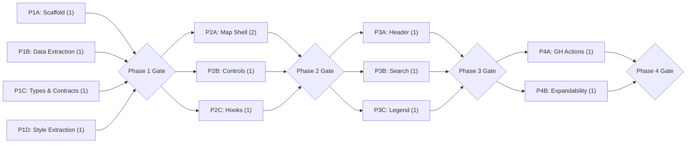

# Foodie Map — React + Vite Migration Dev Plan

> Dev unit size: 0.5 developer-day

## Context

Migrate `docs/external/hk_bib_2026_map.html` (a single-file Leaflet map of HK Michelin Bib Gourmand restaurants) into a production-grade React + Vite + TypeScript project. Preserve all visual design verbatim. Architect for multi-city and multi-guide expandability.

---

## Contracts

| Contract | Producer | Consumer |
|----------|----------|----------|
| `Restaurant[]` JSON schema | Data files in `public/data/` | useGuideData hook |
| `CityConfig` registry | config/cities.ts | App, Header, MapShell |
| `CuisineGroupMap` | config/cuisineGroups.ts | FilterControl, Legend, RestaurantMarker |
| `useFilters` state | hooks/useFilters.ts | FilterControl, MapShell, StatsPanel |
| `useGuideData` fetch | hooks/useGuideData.ts | App (passes down) |

---

## Phase 1: Foundation

| Track | Components | Owner | Deliverables | Dev Units | Depends On |
|---|---|---|---|---|---|
| A: Scaffold | Vite + React + TS project, tsconfig, vite.config (GH Pages base) | — | Working `npm run dev` shell with empty App | 1 | — |
| B: Data Extraction | Extract inline restaurant array → `public/data/hong-kong/michelin-bib-gourmand.json`; extract `cuisineGroups` → `src/config/cuisineGroups.ts` | — | JSON file + config module, both type-checked | 1 | — |
| C: Types & Contracts | `Restaurant` interface, `CuisineGroup` type, `CityConfig` interface, city registry (`src/config/cities.ts`) | — | `src/types/restaurant.ts`, `src/config/cities.ts` | 1 | — |
| D: Style Extraction | Verbatim copy of `<style>` block → `src/styles/global.css`; `index.html` with font + leaflet CDN links | — | `global.css`, `index.html` | 1 | — |

**Gate:** `npm run dev` serves a page. All types compile. JSON is valid and conforms to `Restaurant[]`. CSS file is byte-identical to original `<style>` content.

---

## Phase 2: Core Components

| Track | Components | Owner | Deliverables | Dev Units | Depends On |
|---|---|---|---|---|---|
| A: Map Shell | `MapShell.tsx` — `<MapContainer>`, tile layer, marker cluster group; `RestaurantMarker.tsx` — marker + popup; `HeatLayer.tsx` — conditional heat overlay | — | Map renders with markers from fetched JSON | 2 | Phase 1 Gate |
| B: Controls | `FilterControl.tsx` — Leaflet custom control with cuisine checkboxes; `StatsPanel.tsx` — Leaflet custom control with region counts | — | Controls render inside map, filter toggles work | 1 | Phase 1 Gate |
| C: Hooks | `useGuideData.ts` — fetch `public/data/<city>/<guide>.json`; `useFilters.ts` — active groups set + toggle | — | Hooks unit-testable, data flows to map | 1 | Phase 1 Gate |

**Gate:** Map displays all 70 markers with correct colors. Cuisine filter toggles markers. Stats panel updates on filter change. Heat map toggle works. No visual diff from original page.

---

## Phase 3: Chrome & Search

| Track | Components | Owner | Deliverables | Dev Units | Depends On |
|---|---|---|---|---|---|
| A: Header | `Header.tsx` — title/subtitle, dynamic per city/guide metadata | — | Header renders, matches original | 1 | Phase 2 Gate |
| B: Search | `SearchBar.tsx` — floating search with datalist, locate + fly-to logic | — | Search locates restaurant, map flies to it | 1 | Phase 2 Gate |
| C: Legend | `Legend.tsx` — bottom legend bar with cuisine swatches + coverage note | — | Legend renders, matches original | 1 | Phase 2 Gate |

**Gate:** Full page matches original HTML visually. All interactive features (search, filter, heat toggle, marker popups) work identically.

---

## Phase 4: Deploy & Expandability Validation

| Track | Components | Owner | Deliverables | Dev Units | Depends On |
|---|---|---|---|---|---|
| A: GH Actions | `.github/workflows/deploy.yml` — build → push to `gh-pages` branch | — | CI deploys on push to main | 1 | Phase 3 Gate |
| B: Expandability Smoke | Add a dummy second city entry in `cities.ts` + minimal JSON; verify `useGuideData` fetches correctly; remove dummy after validation | — | Documented expandability path, no regressions | 1 | Phase 3 Gate |

**Gate:** Site live on GitHub Pages. Build passes in CI. Adding a new city requires only: (1) JSON file in `public/data/<city>/`, (2) entry in `cities.ts`. No code changes to components.

---

## Summary

| Phase | Tracks | Total Dev Units | Gate Criteria |
|---|---|---|---|
| Phase 1: Foundation | A: Scaffold, B: Data Extraction, C: Types & Contracts, D: Style Extraction | 4 | Dev server runs, types compile, JSON valid, CSS extracted |
| Phase 2: Core Components | A: Map Shell, B: Controls, C: Hooks | 4 | Map + markers + filters + stats + heat map all functional |
| Phase 3: Chrome & Search | A: Header, B: Search, C: Legend | 3 | Full visual + interactive parity with original |
| Phase 4: Deploy & Expandability | A: GH Actions, B: Expandability Smoke | 2 | Live on GH Pages, expandability validated |
| **Total** | | **13** | |

## Dev Unit Metrics

| Metric | Value |
|---|---|
| Total dev units | 13 |
| Max parallel tracks | 4 (Phase 1) |
| Phases | 4 |
| Critical path length | 5 dev units (P1-A → P2-A → P3-B → P4-A) |

## Dependency Graph

**Critical path:** P1-A (Scaffold) → P2-A (Map Shell) → P3-B (Search) → P4-A (GH Actions) = 5 dev units

## Key Architectural Decisions (for implementer reference)

1. **CSS strategy:** Global CSS only. Extract `<style>` block verbatim. Components use same class names as original HTML. No CSS modules, no Tailwind, no styled-components.
2. **Data loading:** Static JSON in `public/`. Runtime `fetch()`. No data bundled into JS. Adding a city = dropping a file, zero rebuild needed for data-only changes.
3. **Map controls:** Filter panel and Stats panel remain as Leaflet custom controls (not React portals) to preserve exact positioning behavior on the map canvas.
4. **City/guide expansion:** `CityConfig` registry + convention-based file paths (`public/data/<city-id>/<guide-id>.json`). Future city switcher is a UI-only addition — no architecture change needed.
5. **No backward compatibility:** Clean migration. Original HTML file untouched in `docs/external/` for reference only.

## Risks & Mitigations

- **react-leaflet custom controls:** Leaflet controls exist outside React's VDOM. FilterControl and StatsPanel use Leaflet `L.Control` extensions (consistent with original), not React portals. This preserves exact positioning but means those components use imperative DOM manipulation internally.
- **CSS specificity:** Extracting CSS verbatim ensures zero visual change, but future modifications should consider scoping (CSS modules or similar) once the migration is stable.
- **Bundle size:** Leaflet + markercluster + heat loaded via CDN in `index.html` (same as current), keeping the React bundle focused on app logic.
