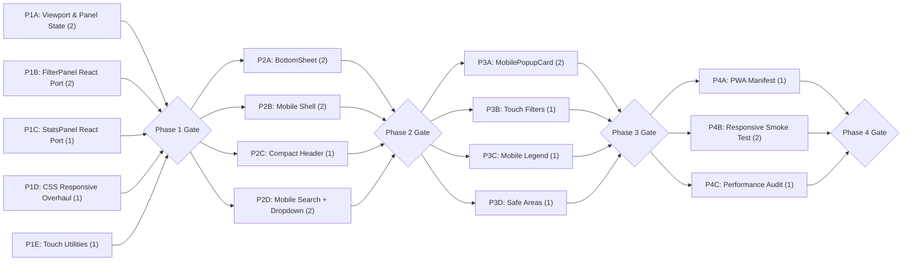

# Foodie Map — Responsive Web + Mobile Follow-up Dev Plan

> Dev unit size: 0.5 developer-day

## Context

The initial React + Vite migration (tech-dev-plan-260504-foodie-map-migration) is complete and functionally correct on desktop. However, the current implementation has significant mobile usability gaps:

1. **Imperative Leaflet controls** (`FilterControl`, `StatsPanel`) are `L.Control` extensions rendered outside React — they cannot participate in responsive layout or adapt to viewport changes.
2. **Fixed layout assumptions** — `.map-shell` enforces `min-height: 720px` (taller than most phone screens); header, search, and legend all assume generous horizontal/vertical space.
3. **No mobile interaction patterns** — no bottom sheet, no collapsible panels, no touch-optimized targets (current filter checkboxes use 13px font, well below the 44px minimum tap target guideline).
4. **Only two CSS breakpoints** (900px, 640px) with cosmetic tweaks — not a true mobile layout.

This plan restructures the UI to deliver a first-class experience on both desktop (≥1024px) and mobile (320–768px) viewports while preserving the existing desktop appearance pixel-for-pixel above 1024px.

### Design Principles

1. **Mobile-first responsive** — Design for 375px upward, enhance for desktop.
2. **Full-screen map on mobile** — Map occupies 100vh; overlays slide in/out.
3. **Bottom sheet pattern** — Filter, Stats, Legend accessible via swipeable bottom sheets on mobile.
4. **Collapsible header** — Header minimizes on scroll/pan on mobile; always visible on desktop.
5. **Touch-optimized** — 44px minimum tap targets; swipe gestures for panels.
6. **Zero visual regression on desktop** — Desktop experience remains identical above 1024px.
7. **No new dependencies for layout** — Pure CSS (container queries + media queries) + minimal React state for panel visibility. No UI framework.

---

## Contracts

| Contract | Producer | Consumer |
|----------|----------|----------|
| `useViewport` hook (breakpoint state) | hooks/useViewport.ts | App, MobileShell, all panel components |
| `usePanelState` hook (panel open/close/minimize state machine) | hooks/usePanelState.ts | MobileShell, BottomSheet, MobileNav, FilterPanel, StatsPanel, Legend |
| `BottomSheet` component (slide-up panel) | components/BottomSheet.tsx | MobileFilterPanel, MobileLegend, MobileStatsPanel |
| `FilterPanel` React component (replaces `createFilterControl`) | components/FilterPanel.tsx | MapShell (desktop via React portal), MobileShell (mobile via BottomSheet) |
| `StatsPanelReact` component (replaces `createStatsPanel`) | components/StatsPanelReact.tsx | MapShell (desktop via React portal), MobileShell (mobile via BottomSheet) |
| `MobilePopupCard` component (full-width marker detail) | components/MobilePopupCard.tsx | MapShell (mobile marker tap) |
| Touch utilities (swipe detection, passive event helpers) | utils/touch.ts | BottomSheet, Collapsible Header |

---

## Phase 1: Responsive Foundation

| Track | Components | Owner | Deliverables | Dev Units | Depends On |
|---|---|---|---|---|---|
| A: Viewport & Panel State System | `useViewport` hook — exposes `isMobile` / `isTablet` / `isDesktop` booleans from `matchMedia` listeners; CSS custom property tokens for spacing, tap-target size, and border-radius at each breakpoint injected via `:root` overrides. `usePanelState` hook — manages which panel is active (filter/stats/legend/none) with TypeScript discriminated union state; supports open/close/minimize; prevents multiple panels open on mobile | — | `hooks/useViewport.ts`, `hooks/usePanelState.ts`, responsive CSS tokens in `global.css` | 2 | — |
| B: FilterPanel React Port | Rewrite `FilterControl.ts` (imperative L.Control) → `FilterPanel.tsx` (React component). Identical markup/CSS class names. Desktop: rendered into a Leaflet control container via React `createPortal`. Mobile: rendered standalone (consumed by BottomSheet in Phase 2) | — | `components/FilterPanel.tsx`, `MapShell.tsx` updated to portal-mount on desktop | 2 | — |
| C: StatsPanel React Port | Rewrite `StatsPanel.ts` (imperative L.Control) → `StatsPanelReact.tsx` (React component). Same approach as Track B — portal on desktop, standalone on mobile | — | `components/StatsPanelReact.tsx`, `MapShell.tsx` updated | 1 | — |
| D: CSS Responsive Overhaul | Replace existing two media queries with a mobile-first breakpoint system (base → 768px → 1024px). Remove `min-height: 720px` from `.map-shell`. Add touch-target sizing (min 44px height for interactive elements). Ensure desktop appearance is pixel-identical above 1024px | — | Updated `global.css` with mobile-first media queries, no desktop visual regressions | 1 | — |
| E: Touch Utilities | `utils/touch.ts` — swipe detection (direction + velocity), passive event helpers; shared by BottomSheet and collapsible header. Pure utility module, no DOM dependency | — | `utils/touch.ts` | 1 | — |

**Gate:** `npm run dev` works. FilterPanel and StatsPanelReact render identically to previous imperative controls on desktop (no visual diff). `useViewport` correctly reports breakpoints. Panel state transitions are testable. CSS compiles, no layout shift on desktop. Touch utilities export correct swipe vectors. All interactive elements ≥ 44px tap target on mobile viewports.

---

## Phase 2: Mobile Layout & Navigation

| Track | Components | Owner | Deliverables | Dev Units | Depends On |
|---|---|---|---|---|---|
| A: BottomSheet | `BottomSheet.tsx` — reusable slide-up panel with drag handle, snap points (collapsed / half / full), backdrop overlay, scroll containment. CSS-driven animation (transform + transition), no JS animation library. Uses touch utilities for swipe detection | — | `components/BottomSheet.tsx`, associated CSS in `global.css` | 2 | Phase 1 Gate |
| B: Mobile Shell | `MobileShell.tsx` — mobile-only layout orchestrator. Renders: compact header (single-line title, tap to expand), full-bleed map, floating action button (FAB) to toggle BottomSheet with filter/stats/legend tabs. Uses `usePanelState` to manage which panel is active; enforces single-panel-at-a-time constraint | — | `components/MobileShell.tsx`, `App.tsx` conditional rendering (desktop layout vs MobileShell) based on `useViewport` | 2 | Phase 1 Gate |
| C: Compact Header | Modify `Header.tsx` — on mobile: single-line truncated title, subtitle hidden by default (expandable on tap). On desktop: unchanged | — | Updated `Header.tsx`, responsive CSS | 1 | Phase 1 Gate |
| D: Mobile Search + Custom Dropdown | Modify `SearchBar.tsx` — replace `<datalist>` with a React-controlled filterable dropdown (consistent across iOS Safari, Chrome Android, and desktop). On mobile: full-width bar docked below compact header, 48px input height, prominent locate button, scrollable results overlay. On desktop: current floating card style with same custom dropdown. Implement ARIA listbox pattern and keyboard navigation | — | Updated `SearchBar.tsx`, responsive CSS, custom dropdown component | 2 | Phase 1 Gate |

**Gate:** On mobile viewport (≤ 768px): map fills entire screen below compact header + search bar. FAB opens BottomSheet with filter panel. Stats and legend accessible via sheet tabs. Only one panel open at a time. Custom search dropdown works consistently on iOS/Android/desktop. No content overlaps. On desktop (≥ 1024px): zero visual change from previous implementation.

---

## Phase 3: Mobile Interaction Polish

| Track | Components | Owner | Deliverables | Dev Units | Depends On |
|---|---|---|---|---|---|
| A: MobilePopupCard | `MobilePopupCard.tsx` — when a marker is tapped on mobile, show a full-width card sliding up from the bottom (not Leaflet's default tiny popup). Includes restaurant name, cuisine tags, address, and a close button. On desktop: standard Leaflet popup unchanged | — | `components/MobilePopupCard.tsx`, MapShell integration for mobile marker tap | 2 | Phase 2 Gate |
| B: Touch-Optimized Filters | Restyle filter items on mobile: pill-shaped toggle buttons (not checkboxes), 44px min height, cuisine color as background tint, active/inactive states with clear visual contrast. Desktop: unchanged checkbox style | — | Updated `FilterPanel.tsx` mobile variant, CSS additions | 1 | Phase 2 Gate |
| C: Mobile Legend | Restyle legend on mobile: horizontal scrollable strip (not wrapping grid) docked above BottomSheet. Swipe-friendly. Coverage note accessible via info icon tap. Desktop: unchanged | — | Updated `Legend.tsx` mobile variant, CSS additions | 1 | Phase 2 Gate |
| D: Safe Area & Viewport Fixes | Add `env(safe-area-inset-*)` padding for notched devices. Add `<meta name="viewport">` `viewport-fit=cover`. Prevent iOS rubber-band scroll on map. Ensure BottomSheet respects home indicator area | — | Updated `index.html`, CSS safe-area rules | 1 | Phase 2 Gate |

**Gate:** On mobile: marker tap shows full-width detail card. Filter pills are easily tappable. Legend scrolls horizontally without layout shift. App renders correctly on notched devices (iPhone 14/15/16 safe areas). No regressions on desktop.

---

## Phase 4: Cross-Device Validation & PWA

| Track | Components | Owner | Deliverables | Dev Units | Depends On |
|---|---|---|---|---|---|
| A: PWA Manifest | Add `manifest.json` (app name, icons, theme color, `display: standalone`). Register service worker for offline shell caching. Add Apple touch icon and splash screen meta tags. Enables "Add to Home Screen" on iOS/Android | — | `public/manifest.json`, `public/icons/` set, SW registration in `main.tsx`, updated `index.html` meta tags | 1 | Phase 3 Gate |
| B: Responsive Smoke Test | Manual test matrix: iPhone SE (375px), iPhone 15 Pro (393px), iPad Mini (768px), Desktop 1440px. Verify: layout, tap targets, BottomSheet snap points, search dropdown, filter pills, popup card, legend, safe areas. Document results and fix any issues found | — | Test report, bug fixes | 2 | Phase 3 Gate |
| C: Performance Audit | Lighthouse mobile audit. Optimize: lazy-load BottomSheet and mobile components via `React.lazy` (desktop bundle unaffected), reduce paint on sheet animation (will-change, contain), ensure map tiles don't re-render on sheet open/close. Target: Lighthouse performance ≥ 90 on mobile | — | Performance fixes, documented Lighthouse score | 1 | Phase 3 Gate |

**Gate:** PWA installable on iOS and Android. Lighthouse mobile score ≥ 90. All test matrix viewports pass visual/functional checks. No desktop regressions. GitHub Pages deploy succeeds.

---

## Summary

| Phase | Tracks | Total Dev Units | Gate Criteria |
|---|---|---|---|
| Phase 1: Responsive Foundation | A: Viewport & Panel State, B: FilterPanel React Port, C: StatsPanel React Port, D: CSS Responsive Overhaul, E: Touch Utilities | 7 | Hooks testable, controls ported, responsive CSS, desktop pixel-identical |
| Phase 2: Mobile Layout & Navigation | A: BottomSheet, B: Mobile Shell, C: Compact Header, D: Mobile Search + Custom Dropdown | 7 | Full mobile layout with BottomSheet, FAB, panel exclusivity, custom search, desktop unchanged |
| Phase 3: Mobile Interaction Polish | A: MobilePopupCard, B: Touch-Optimized Filters, C: Mobile Legend, D: Safe Area & Viewport Fixes | 5 | Touch-optimized interactions, safe area support, no desktop regressions |
| Phase 4: Cross-Device Validation & PWA | A: PWA Manifest, B: Responsive Smoke Test, C: Performance Audit | 4 | PWA installable, Lighthouse ≥ 90, all viewports pass |
| **Total** | | **23** | |

## Dev Unit Metrics

| Metric | Value |
|---|---|
| Total dev units | 23 |
| Max parallel tracks | 5 (Phase 1) |
| Phases | 4 |
| Critical path length | 8 dev units (P1-B → P2-A → P3-A → P4-B) |

## Dependency Graph

**Critical path:** P1-B (FilterPanel React Port) → P2-A (BottomSheet) → P3-A (MobilePopupCard) → P4-B (Responsive Smoke Test) = 8 dev units

## Key Architectural Decisions

1. **Control porting strategy:** FilterControl and StatsPanel must be rewritten from imperative `L.Control` extensions to React components. On desktop, these are mounted into Leaflet's control containers via `ReactDOM.createPortal()` to preserve exact positioning. On mobile, they render inside BottomSheet — standard React flow. This is a prerequisite for all mobile layout work.

2. **BottomSheet — CSS-only animation:** The BottomSheet uses `transform: translateY()` + CSS `transition` for slide animation. No JS animation library. Snap points (collapsed 0%, half 50%, full 85%) are managed via a state machine in the component. Drag gesture uses pointer events with a velocity threshold (from touch utilities) to determine snap target.

3. **Panel exclusivity on mobile:** Only one panel open at a time, managed by `usePanelState` with TypeScript discriminated union state (filter/stats/legend/none). Prevents overlapping sheets on small screens. On desktop, multiple controls can be visible simultaneously (Leaflet's existing behavior).

4. **Mobile-first CSS, desktop-override:** The responsive overhaul flips the CSS strategy from desktop-default to mobile-first. Base styles target ≤ 768px. `@media (min-width: 768px)` handles tablet. `@media (min-width: 1024px)` restores the current desktop appearance. This ensures mobile is not an afterthought.

5. **Conditional rendering, not CSS hiding:** `MobileShell` vs desktop layout is chosen via `useViewport` hook in `App.tsx`. The two layout trees share the same data hooks and FilterPanel/StatsPanel components but compose them differently. This avoids loading desktop-only DOM on mobile and vice versa.

6. **Mobile popup card replaces Leaflet popup:** On mobile, marker taps render `MobilePopupCard` (a React component sliding up from the bottom) instead of Leaflet's built-in popup. The Leaflet popup is suppressed via `marker.unbindPopup()` on mobile. This gives full control over layout, typography, and touch dismissal.

7. **Custom search dropdown:** Replaces browser-native `<datalist>` with a React-controlled filterable list that behaves consistently across iOS Safari, Chrome Android, and desktop browsers. Implements ARIA listbox pattern for accessibility with keyboard navigation and focus trap on mobile overlay.

8. **Progressive code-splitting:** Mobile-specific components (`BottomSheet`, `MobileShell`, `MobilePopupCard`, `MobileNav`) are loaded via `React.lazy` only when `useViewport` reports mobile. Desktop bundle size remains unaffected.

9. **PWA for home-screen experience:** Adding `manifest.json` + service worker transforms the app into an installable PWA. On mobile, "Add to Home Screen" provides a full-screen, app-like experience with no browser chrome — critical for a map-centric tool.

10. **No new dependencies for responsive layout:** BottomSheet, viewport detection, touch utilities, and responsive CSS are all implemented with native APIs (`matchMedia`, pointer events, CSS transitions). No UI framework (e.g., MUI, Radix) is introduced. This keeps the bundle lean and avoids style conflicts with the existing global CSS.

## Risks & Mitigations

| Risk | Impact | Mitigation |
|---|---|---|
| React portal into Leaflet control containers — Leaflet may re-render control containers on certain map events | Medium | Stable `useEffect` that only portals after map init; verify container stability across zoom/pan events |
| BottomSheet gesture conflicts with map pan | Medium | BottomSheet calls `L.DomEvent.disableClickPropagation` and `disableScrollPropagation` on its container; applies `touch-action: none` during active drag |
| iOS Safari dynamic viewport jank (`100vh` includes address bar) | Medium | Use `100dvh` with `100vh` fallback; `env(safe-area-inset-bottom)` for BottomSheet positioning |
| Desktop visual regression from control React port | Medium | Phase 1 gate requires pixel-identical desktop rendering, verified by screenshot comparison before/after |
| Custom search dropdown accessibility | Medium | ARIA listbox pattern, keyboard navigation, focus trap on mobile overlay; tested with VoiceOver |
| Mobile performance — markers + cluster + BottomSheet on low-end phones | Low | Phase 4 performance audit targets Lighthouse ≥ 90; BottomSheet uses `will-change: transform` and `contain: layout`; mobile components lazy-loaded |
| Leaflet gesture conflicts with touch utility swipe detection | Low | Touch utilities capture events only within their registered containers; Leaflet map interaction disabled when BottomSheet is in `full` snap point |
